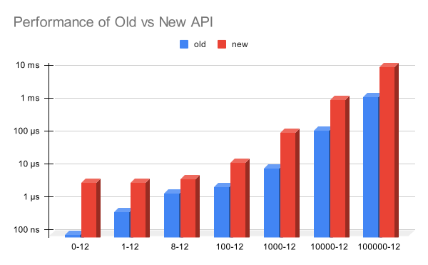
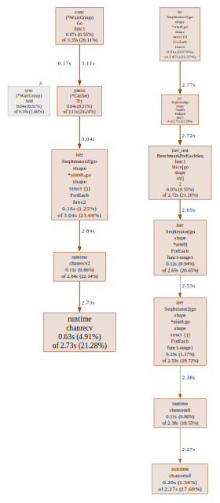

# rangefunc in sourcegraph/conc? I sure hope this answers your question.

I tried adding [`rangefunc`](https://go.dev/wiki/RangefuncExperiment) into
[sourcegraph/conc](https://github.com/sourcegraph/conc). The answer may or may
not shock you!!\!

## How It's Done

Adapting `rangefunc` into `conc` was seemingly straightforward at first, but
the actual implementation turned out to be very deceiving.

Let's compare the old slice-iterating API with our new iterator function API.

**Old API:**

``` go
type Iterator[T any] struct{ ... }

func ForEach[T any](input []T, f func(*T))
func ForEachIdx[T any](input []T, f func(int, *T))
```

**New API:**

``` go
type SeqIterator[T any] SeqIterator2[T, struct{}]
type SeqIterator2[T1, T2 any] struct{ ... }

func ForEachSeq[T any](input iter.Seq[T], f func(T) bool)
func ForEachSeq2[T1, T2 any](input iter.Seq2[T1, T2], f func(T1, T2) bool)
```

Using this API the old way is pretty simple thanks to the added `iter.Slice`
function:

``` go
var items []T

iter.ForEachSeq(iter.Slice(items), func(item *T) bool {
    fmt.Println(item)
    return item != otherItem
})
```

Seems really nice! Let's see how well it fares up with the old way, though.

## Benchmarking

The same benchmark for the old API was adapted for the new API:

``` go
func BenchmarkForEach(b *testing.B) {
	for _, count := range []int{0, 1, 8, 100, 1000, 10000, 100000} {
		b.Run(strconv.Itoa(count), func(b *testing.B) {
			ints := make([]int, count)
			for i := 0; i < b.N; i++ {
				iter.ForEach(ints, func(i *int) {
					*i = 0
				})
			}
		})
	}
}

func BenchmarkForEachSeq(b *testing.B) {
	for _, count := range []int{0, 1, 8, 100, 1000, 10000, 100000} {
		b.Run(strconv.Itoa(count), func(b *testing.B) {
			ints := make([]int, count)
			for i := 0; i < b.N; i++ {
				iter.ForEachSeq(iter.Slice(ints), func(i *int) bool {
					*i = 0
					return true
				})
			}
		})
	}
}
```

With that, we get......\!

``` 
goos: linux
goarch: amd64
pkg: github.com/sourcegraph/conc/iter
cpu: AMD Ryzen 5 5500
BenchmarkForEach/0-12               13006621                90.88 ns/op
BenchmarkForEach/1-12                2581810               466.6 ns/op
BenchmarkForEach/8-12                 717111              1673 ns/op
BenchmarkForEach/100-12               381052              2700 ns/op
BenchmarkForEach/1000-12              120592              9618 ns/op
BenchmarkForEach/10000-12               8203            138825 ns/op
BenchmarkForEach/100000-12               849           1421924 ns/op
BenchmarkForEachSeq/0-12              344376              3484 ns/op
BenchmarkForEachSeq/1-12              276270              3639 ns/op
BenchmarkForEachSeq/8-12              235436              4494 ns/op
BenchmarkForEachSeq/100-12             81866             14265 ns/op
BenchmarkForEachSeq/1000-12             9168            116968 ns/op
BenchmarkForEachSeq/10000-12             945           1166079 ns/op
BenchmarkForEachSeq/100000-12             92          11510798 ns/op
PASS
ok          github.com/sourcegraph/conc/iter        18.940s
```

Wait, what? The new implementation performs **8x to 38x worse**? **Hell yeah it does\!**



## How?\!

Before I explain how I even implemented this code, let's try and profile it
first. Experienced Go developers may be able to immediately point out why the
new implementation is slower, but we want to explain this to everyone, so we'll
just have Go tell us what's slow\!

Below is the result of `go tool pprof -web`, which draws a flow chart of what
function and where a lot of time is spent.



It was channels all along! Why do we need channels, anyway?

## Iterators and Concurrency

With a bit of reasoning, we can figure out pretty quickly that you just can't
concurrently iterate over an `iter.Seq[T]`, unlike a regular slice. Take this
very basic slice iterator as an example:

``` go
func Slice[T any](input []T) Seq[T] {
    return func(yield func(v T) bool) {
        for _, v := range input {
            if !yield(v) {
                return
            }
        }
    }
}
```

When you use this iterator as `for v := range Slice(slice) {}`, the compiler
will compile roughly this as:

``` go
iter := Slice(slice)
iter(func(v T) bool { return true })
```

To fit this into multiple goroutines, you need to find a way to take this `v`
and push it to those goroutines. The most straightforward way to do this is to
use a channel:

``` go
ch := make(chan T)

iter := Slice(slice)
iter(func(v T) bool {
    ch <- v
    return true
})

go func() {
    for v := range ch {
        // do something with v
    }
}()
```

This is vaguely how the implementation works, but with some more complexity to
handle `return false` which interrupts the iteration.

## Is it worth it?

In the end, the final use case is what matters the most.

There are valid use cases for when you would want to use the new API over the
old API. For example, if you have so many items that you can't allocate a slice
for, but you also don't want to trudge through `conc/pool` yourself when you
already have a nice little iterator for it. The performance might be worse than
iterating over a slice, but it's still roughly the same as writing your own
`conc/pool` <sup>\[citation needed\]</sup>.

With the new API, you also have the ability to interrupt the iteration when
`false` is returned from the callback. The old API did not have this, despite
it being really simple to implement. Doing so in the new API adds quite a lot
of overhead because of `select` though.

Do I think it's worth it? No. That's why I'm not making this a PR.
